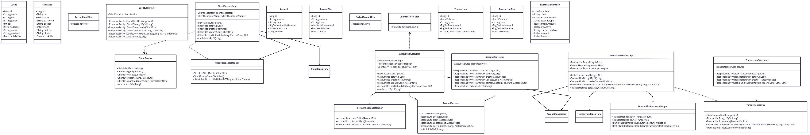

# java-account-microservice-backend


### Diagrama-de-componentes



### Architecture based on microservices

```bash
.
├── main
│   ├── java
│   │   └── com
│   │       └── devsu
│   │           └── hackerearth
│   │               └── backend
│   │                   └── account
│   │                       ├── AccountApplication.java
│   │                       ├── client
│   │                       │   └── ClientServiceFeign.java
│   │                       ├── controller
│   │                       │   ├── AccountController.java
│   │                       │   └── TransactionController.java
│   │                       ├── exception
│   │                       │   ├── ApiExceptionHandler.java
│   │                       │   ├── ApiExceptionResponse.java
│   │                       │   └── BussinesRuleException.java
│   │                       ├── mapper
│   │                       │   ├── AccountResponseMapper.java
│   │                       │   └── TransactionResponseMapper.java
│   │                       ├── model
│   │                       │   ├── Account.java
│   │                       │   ├── Base.java
│   │                       │   ├── dto
│   │                       │   │   ├── AccountDto.java
│   │                       │   │   ├── BankStatementDto.java
│   │                       │   │   ├── ClientDto.java
│   │                       │   │   ├── PartialAccountDto.java
│   │                       │   │   └── TransactionDto.java
│   │                       │   └── Transaction.java
│   │                       ├── repository
│   │                       │   ├── AccountRepository.java
│   │                       │   └── TransactionRepository.java
│   │                       └── service
│   │                           ├── AccountServiceImpl.java
│   │                           ├── AccountService.java
│   │                           ├── TransactionServiceImpl.java
│   │                           └── TransactionService.java
│   └── resources
│       ├── application.properties
│       ├── static
│       └── templates
└── test
    └── java
        └── com
            └── devsu
                └── hackerearth
                    └── backend
                        └── account
                            ├── AccountApplicationTests.java
                            ├── sampleTest.java
                            └── service
                                ├── AccountServiceImplTest.java
                                └── TransactionServiceImplTest.java

```

The architecture of the generated project consists of :

1. `configuration` contains all the external library implementations to be configured inside spring-boot.
2. `controller` contains the communication interfaces with the client.
3. `entity` contains the persistence domains.
4. `exception` contains the custom-exception classes handled by in the code.
5. `extension` contains the classes that modify system functionality.
6. `helper` contains functionality necessary for general operation.
7. `dto` contains classes that separate in-memory objects from the database.
8. `repository` contains the classes or components that encapsulate the logic necessary to access the data sources.
9. `service` contains the interfaces and implementations that define the functionality provided by the service.

## Requirements

To run the application artifact you need:

- [JDK 11](https://www.oracle.com/java/technologies/javase/jdk11-archive-downloads.html)